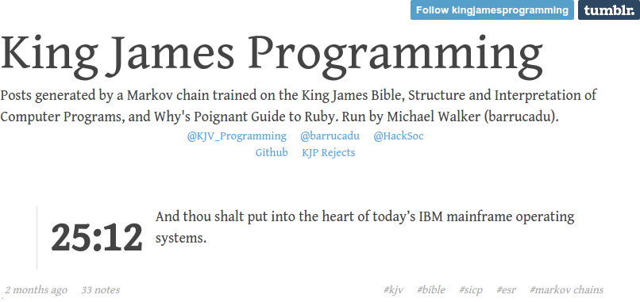
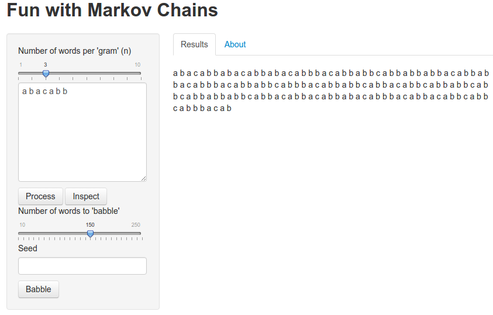
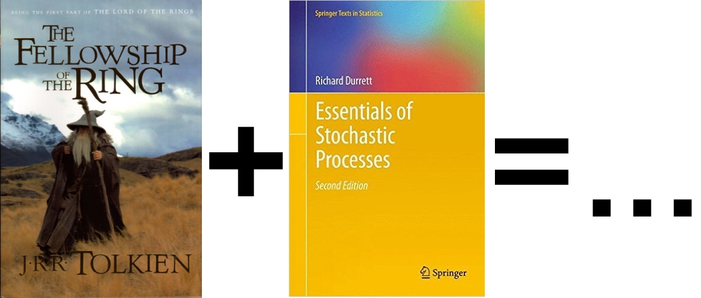
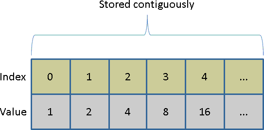
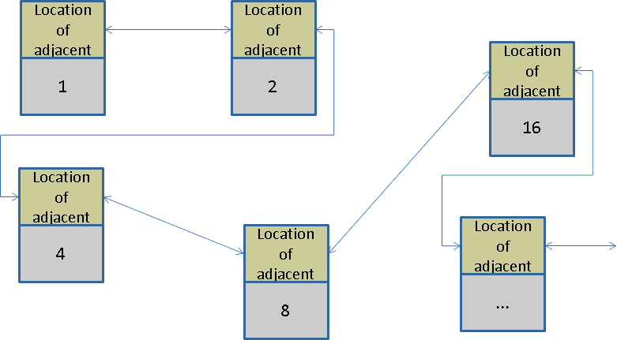

```{r, echo=FALSE}
library(knitr)
opts_chunk$set(cache=TRUE, fig.height=4, fig.width=4)

library(DiagrammeR)
library(DiagrammeRsvg)
library(magrittr)
library(svglite)
library(rsvg)
library(png)


knitrgraph <- function(graph_code, file)
{
  graph <- grViz(paste0("
  digraph {

  # graph attributes
  graph [overlap = true, rankdir=LR]

  # node attributes
  node [shape = circle,
  fontname = Helvetica,
  color = blue,
  style = filled,
  fillcolor='#D3D3D3']

  # edge attributes
  edge [color = gray]

  # node statements
  node [shape = circle,
  fontname = Helvetica,
  color = grey, 
  style=empty]
", graph, "}", collapse=""))
  
  invisible(capture.output(svg <- export_svg(graph)))
  png::writePNG(rsvg(charToRaw(svg)), file)
  
  img <- readPNG(file)
  grid::grid.raster(img)
}
```


## Contents

* Background
* The ngram Package
* Using the ngram Package
* A Real Analysis Using ngram
* A Little Computer Science
* Other Packages
* Wrapup


# Background

## Motivation

One day, while bored...




## Modeling Human Language

* Even today, most models assume "bag of words".
* Bag of words model: *only multiplicity matters*.
* "All models are wrong, ..."
* Beyond a bag of words.
    - grammar
    - word order


## n-gram

* n-gram:
    - *ordered* sequence of "words"
    - taken n at a time
    - contiguous
* "words"
    - letters
    - syllables
    - actual words
* The larger n is, the closer it models the input text (to the point of being useless!).


## Example

<br><br><br>
<font size=100px>*To be or not to be, that is the question.*</font>


## Example:  1-grams
*To be or not to be, that is the question.*

* to
* be
* or
* not
* to
* be
* ...


## Example: 1-grams
```{r, echo=FALSE, fig.width=8}
graph <- "
  to   [label='to'];
  be   [label='be'];
  or   [label='or'];
  not  [label='not'];
  that [label='that'];
  is   [label='is'];
  the  [label='the'];
  q    [label='question'];
  
  # edge statements
  to->be [label='100%'];
  
  be->or [label='50%'];
  be->that [label='50%'];
  
  or->not [label='100%'];
  
  not->to [label='100%'];
  
  that->is [label='100%'];
  
  is->the [label='100%'];
  
  the->q [label='100%'];
"

file <- "pics/hamlet_1gram.png"
knitrgraph(graph, file)
```


## Example:  2-grams
*To be or not to be, that is the question.*

* to be
* be or
* or not
* not to
* to be
* ...


## Example: 2-grams
```{r, echo=FALSE, fig.width=8}
graph <- "
  tobe [label='to be'];
  beor [label='be or'];
  ornot [label='or not'];
  notto [label='not to'];
  bethat [label='be that'];
  thatis [label='that is'];
  isthe [label='is the'];
  thequestion [label='the\nquestion'];
  
  # edge statements
  tobe->beor [label='50%'];
  tobe->bethat [label='50%'];
  beor->ornot [label='100%'];
  ornot->notto [label='100%'];
  notto->tobe [label='100%'];
  bethat->thatis [label='100%'];
  thatis->isthe [label='100%'];
  isthe->thequestion [label='100%'];
"

file <- "pics/hamlet_2gram.png"
knitrgraph(graph, file)
```


## Example:  3-grams
*To be or not to be, that is the question.*

* to be or
* be or not
* or not to
* not to be
* to be that
* ...

## Example:  9-grams

*To be or not to be, that is the question.*

* to be or not to be that is the
* be or not to be that is the question


## Applications
* Sometimes directly informative.
* [Google Ngram Viewer](https://books.google.com/ngrams)
* Plagiarism detection
* Spell checking
* Genome sequence validation.
* [Fuzzy string searching](http://ntz-develop.blogspot.com/2011/03/fuzzy-string-search.html)
* Language modeling...

## Criticisms of n-grams
* Short version "too simplistic".
* "Colorless green ideas sleep furiously" -- Noam Chomsky
* [*On Chomsky and the Two Cultures of Statistical Learning*](http://norvig.com/chomsky.html), Peter Norvig


# Markov Chains

## A Little History


* Invented by Andrey Markov to show LLN didn't need independence.
* [DEVELOPED OUT OF SPITE!](http://www.americanscientist.org/issues/pub/first-links-in-the-markov-chain/5)


## n-grams and Markov Chains
* Get all n-grams
* Also get all "next words"
* E.g.: "to be or not to be, that..."
    - to be
        - or
        - that
    - be or
        - not
    - ...


## n-grams and Markov Chains
* Can generate new text with same statistical properties as the old text.
* Just sample!

## Example
a b a c a b b

## 1-grams: a b a c a b b
```{r, echo=FALSE, fig.width=8}
graph <- "
  a [label='a'];
  b [label='b'];
  c [label='c'];
  
  # edge statements
  a->b [label='67%'];
  a->c [label='33%'];
  
  b->a [label='50%'];
  b->b [label='50%'];
  
  c->a [label='100%'];
"

file <- "pics/bloodcode.png"
knitrgraph(graph, file)
```


## 1-grams: a b a c a b b
```{r, cache=FALSE}
len <- 40
ng <- ngram::ngram("a b a c a b b", n=1)
x <- ngram::babble(ng, len, seed=1234)
table(strsplit(x, split=" "))/len
```

## 2-grams: a b a c a b b
```{r, echo=FALSE, fig.width=8}
graph <- "
  ba [label='b a'];
  ca [label='c a'];
  ab [label='a b'];
  ac [label='a c'];
  bb [label='b b'];

  # edge statements
  ba->ac [label='100%'];
  ca->ab [label='100%'];
  ab->ba [label='50%'];
  ab->bb [label='50%'];
  ac->ca [label='100%'];
"

file <- "pics/bloodcode_2grams.png"
knitrgraph(graph, file)
```


## 2-grams: a b a c a b b
```{r, cache=FALSE}
len <- 40
ng <- ngram::ngram("a b a c a b b", n=2)
x <- ngram::babble(ng, len, seed=1234)
x
table(strsplit(x, split=" "))/len
```


## Sampling Distributions
Simulating 10,000,000 draws, we get the mixing proportions:
```{r, eval=FALSE, echo=FALSE, cache=FALSE, results='asis'}
library(ngram)
library(xtable)
len <- 10000000
counter <- function(x, len) table(strsplit(x, split=" "))/len
str <- "a b a c a b b"

ct <- counter(str, 7)

ng <- ngram(str, n=1)
x <- babble(ng, len, seed=1234)
c1 <- counter(x, len)

ng <- ngram(str, n=2)
x <- babble(ng, len, seed=1234)
c2 <- counter(x, len)

ng <- ngram(str, n=3)
x <- babble(ng, len, seed=1234)
c3 <- counter(x, len)

tab <- rbind(ct, c1, c2, c3)
rownames(tab) <- c("Truth", "1-grams", "2-grams", "3-grams")
print(xtable(tab), type="html")
```

```
                a         b         c
Truth   0.4285714 0.4285714 0.1428571
1-grams 0.3751439 0.4499021 0.1749540
2-grams 0.3889055 0.4166573 0.1944372
3-grams 0.3600209 0.4800028 0.1599763
```


# The ngram Package

## Revisiting the Crucial Problem
* KJP is open source...nice!
* ...but it's written in Python


## Python?

## Python?
<b><font style="font-size:160px" color="red">DISGUSTING</b></font>


## 
<center>

</center>


## The ngram package
* R package.
    * CRAN https://cran.r-project.org/web/packages/ngram/index.html
    * GitHub https://github.com/wrathematics/ngram
* Heavy lifting done in C.
* High performance n-gram tokenizer and babbler.
* Also builds as a standalone shared library.


## WebApp
* Hosted --- https://wrathematics.shinyapps.io/ngram
* Source --- https://github.com/wrathematics/ngram

<center>

</center>


# Lord of the Markov Chains

## In a hole in the ground, there lived a stochastic process.

<center>

</center>

## n=2
>You, Legolas, must answer to fractions using the fact that $\phi$ is increasing.

## n=2
>Awake! Fear! Fire! Foes! Awake! Fatty Bolger was still dark in the 
system after n plays.

## n=2
>'The expected value decreases with each good night to you,' said Boromir.

## n=3
>'Now! ' shouted Gandalf. 'Now is the last one we will let $E_n (y) = E(y | S_n = s_n , . . . k − 1}$.


## n=3
>"We must decide before we go", said Frodo. "It would be the death of me. It would be safer to wait here than that if I go through the algebra needed to demonstrate this for the general case."

## n=3
>Our days have darkened, and we have shown $||X_i − Y_i|| \leq p_i$.


# A Little Computer Science

## Common Data Structures
* Arrays
* Linked lists
* Deques - double ended queue (also stacks and queues)


## Arrays



## Linked Lists


## Deques



## Data Structures in R
* Array
* List (also an array!)
* Environments (hash table)
* Roll your own (hard!)


## R Lists
Growing a list is expensive.

```r
n <- 1e5

system.time({
  l1 <- list()
  for (i in 1:n) l1[[i]] <- i
})
```

```
##   user  system elapsed
## 32.636   0.008  32.611
```

## Deques
Growing a deque is cheap.

```r
library(dequer)

system.time({
  dl <- deque()
  for (i in 1:n) pushback(dl, i)
  l2 <- as.list(dl)
})
rev(dl);rm(dl)
```

```
## user  system elapsed
## 0.44    0.00    0.44
```


## Same Destination, Different Path
```r
all.equal(l1, l2)
```

```
[1] TRUE
```


## So What's the Deal?
* Arrays are contiguous!
* Want to add a new thing to an array?
    - Allocate new storage.
    - Copy over old storage.
    - Add new thing.
    - Garbage collect old storage.
* Do this a million times...


## Sometimes Better to Not Store Contiguously
* Deques and linked lists are *not* (necessarily) contiguous.
* Insertions/deletions are very cheap --- $O(1)$.
* Lookups are expensive --- $O(n)$.


## Why Are We Talking About This?
Given a text of `n` words where order matters (not a bag of words), how many n-grams are there (not counting multiplicity)?


## Some Crappy Bounds
Fix $n$ and call the number of n-grams $N$ and the number of words $W$.

* $N \geq 1$
* $N \leq W - n + 1$


## Can We Do Better?
<center>

</center>

## What Do We Do?
* So we really have no idea how many there are...
* How to store them?
* We use a linked list!


# Proof I Know What I'm Doing

## tau --- text analysis utilities
* Facilities for n-grams and more.
* Incorporates some pre-processing with tokenization.
* Much more general than `ngram`...
* Also much slower!


## Benchmarking Against tau
```r
library(tau)
library(ngram)

x <- ngram::rcorpus(100000)

tautime <- system.time(pt1 <- textcnt(x, n=3, split=" ", method="string"))[3]
ngtime <- system.time(pt2 <- ngram(x, n=3))[3]

cat("tau: ", tautime, "\nngram: ", ngtime, "\ntau/ngram: ", tautime/ngtime, "\n")
```

```
## tau:  32.671 
## ngram:  0.078 
## tau/ngram:  418.859 
```


# Wrapup

## Summary
* n-grams are simple, but useful models of human language.
* `ngram` is a high performance R package for constructing n-grams.
* Computers are complicated.


## `~`Thanks!`~`
 Email: wrathematics@gmail.com

 GitHub: https://github.com/wrathematics

 Web: http://wrathematics.info

 Blog: http://librestats.com

 Twitter: @wrathematics


<br><br>
<center>
  Slides available: http://fixme.com
</center>
