```{r, echo=FALSE}
library(knitr)
opts_chunk$set(cache=TRUE, fig.height=4, fig.width=4)

library(DiagrammeR)
library(DiagrammeRsvg)
library(magrittr)
library(svglite)
library(rsvg)
library(png)


knitrgraph <- function(graph_code, file)
{
  graph <- grViz(paste0("
  digraph {

  # graph attributes
  graph [overlap = true, rankdir=LR]

  # node attributes
  node [shape = circle,
  fontname = Helvetica,
  color = blue,
  style = filled,
  fillcolor='#D3D3D3']

  # edge attributes
  edge [color = gray]

  # node statements
  node [shape = circle,
  fontname = Helvetica,
  color = grey, 
  style=empty]
", graph, "}", collapse=""))
  
  invisible(capture.output(svg <- export_svg(graph)))
  png::writePNG(rsvg(charToRaw(svg)), file)
  
  img <- readPNG(file)
  grid::grid.raster(img)
}
```


# Background

## Motivation

One day, while bored...

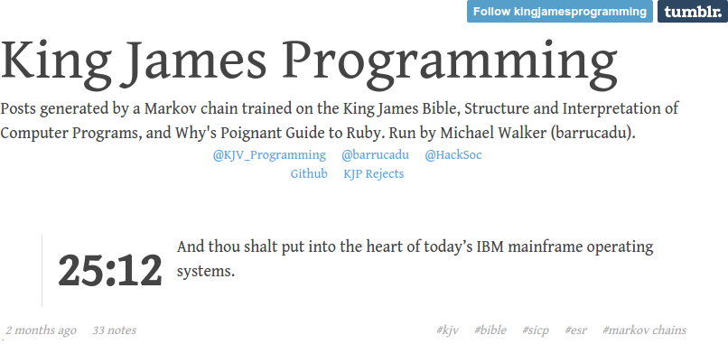


## Modeling Human Language

* Even today, most models assume "bag of words".
* Bag of words model: *only multiplicity matters*.
* "All models are wrong, ..."
* Beyond a bag of words.
    - grammar
    - word order


## n-gram

* n-gram:
    - *ordered* sequence of "words"
    - taken n at a time
    - contiguous
* "words"
    - letters
    - syllables
    - actual words
* The larger n is, the closer it models the input text (to the point of being useless!).


## Example
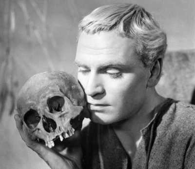
<br><br><br>
<font size=100px>*To be or not to be, that is the question.*</font>


## Example:  1-grams
*To be or not to be, that is the question.*

* to
* be
* or
* not
* to
* be
* ...


## Example: 1-grams
```{r, echo=FALSE, fig.width=8}
graph <- "
  to   [label='to'];
  be   [label='be'];
  or   [label='or'];
  not  [label='not'];
  that [label='that'];
  is   [label='is'];
  the  [label='the'];
  q    [label='question'];
  
  # edge statements
  to->be [label='100%'];
  
  be->or [label='50%'];
  be->that [label='50%'];
  
  or->not [label='100%'];
  
  not->to [label='100%'];
  
  that->is [label='100%'];
  
  is->the [label='100%'];
  
  the->q [label='100%'];
"

file <- "pics/hamlet_1gram.png"
knitrgraph(graph, file)
```


## Example:  2-grams
*To be or not to be, that is the question.*

* to be
* be or
* or not
* not to
* to be
* ...


## Example: 2-grams
```{r, echo=FALSE, fig.width=8}
graph <- "
  tobe [label='to be'];
  beor [label='be or'];
  ornot [label='or not'];
  notto [label='not to'];
  bethat [label='be that'];
  thatis [label='that is'];
  isthe [label='is the'];
  thequestion [label='the\nquestion'];
  
  # edge statements
  tobe->beor [label='50%'];
  tobe->bethat [label='50%'];
  beor->ornot [label='100%'];
  ornot->notto [label='100%'];
  notto->tobe [label='100%'];
  bethat->thatis [label='100%'];
  thatis->isthe [label='100%'];
  isthe->thequestion [label='100%'];
"

file <- "pics/hamlet_2gram.png"
knitrgraph(graph, file)
```


## Example:  3-grams
*To be or not to be, that is the question.*

* to be or
* be or not
* or not to
* not to be
* to be that
* ...

## Example:  9-grams

*To be or not to be, that is the question.*

* to be or not to be that is the
* be or not to be that is the question


## Applications
* Sometimes directly informative.
* [Google Ngram Viewer](https://books.google.com/ngrams)
* Plagiarism detection
* Spell checking
* Genome sequence validation.
* [Fuzzy string searching](http://ntz-develop.blogspot.com/2011/03/fuzzy-string-search.html)
* Language modeling...

## Criticisms of n-grams
* Short version "too simplistic".
* "Colorless green ideas sleep furiously" -- Noam Chomsky
* [*On Chomsky and the Two Cultures of Statistical Learning*](http://norvig.com/chomsky.html), Peter Norvig


# The ngram Package

## Revisiting the Crucial Problem
* KJP is open source...nice!
* ...but it's written in Python


## Python?

## Python?
<b><font style="font-size:160px" color="red">DISGUSTING</b></font>


## 
<center>
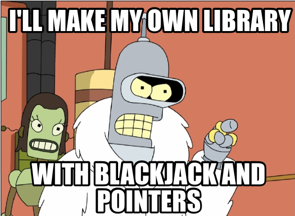
</center>


## The ngram package
* R package.
    * CRAN https://cran.r-project.org/web/packages/ngram/index.html
    * GitHub https://github.com/wrathematics/ngram
* Heavy lifting done in C.
* High performance n-gram tokenizer and babbler.
* Also builds as a standalone shared library.


## WebApp
* Hosted --- https://wrathematics.shinyapps.io/ngram
* Source --- https://github.com/wrathematics/ngram

<center>
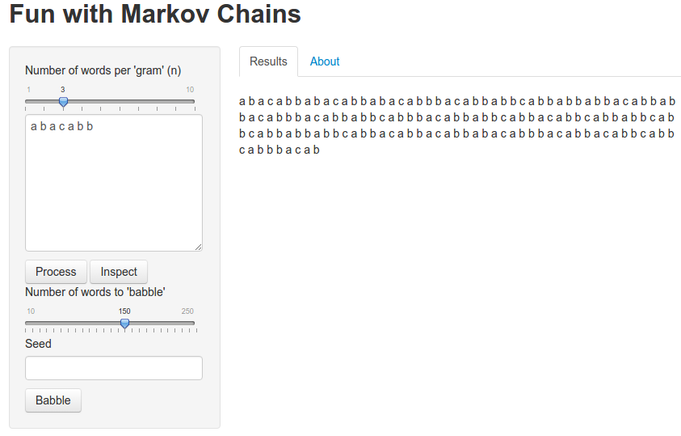
</center>


# Lord of the Markov Chains

## In a hole in the ground, there lived a stochastic process.
<center>
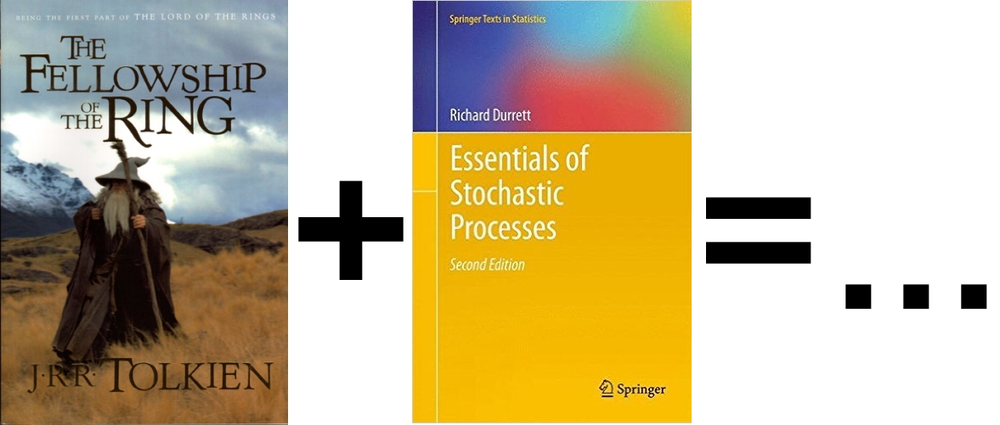
</center>

## n=2
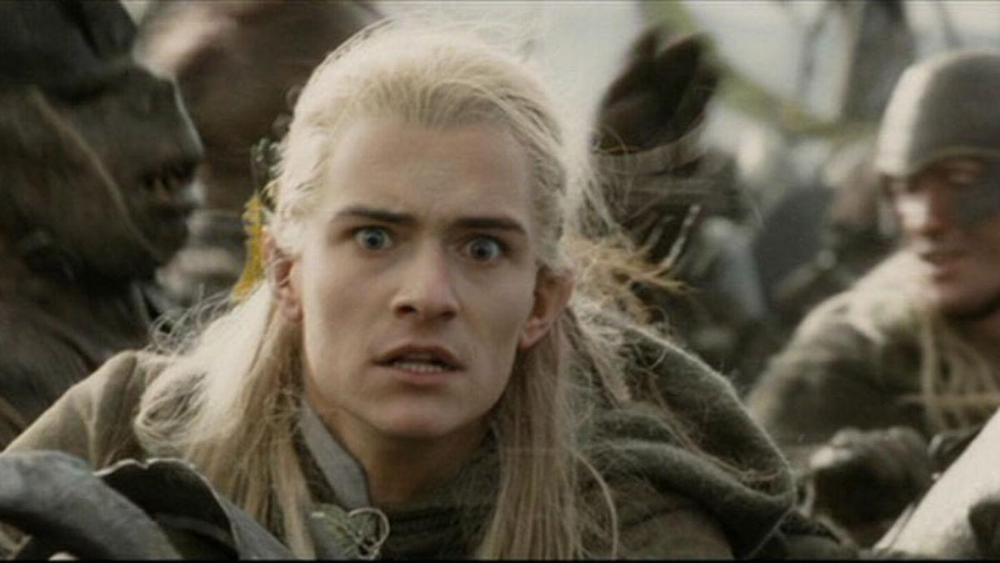
<br><br><br><br>
You, Legolas, must answer to fractions using the fact that $\phi$ is increasing.

## n=2
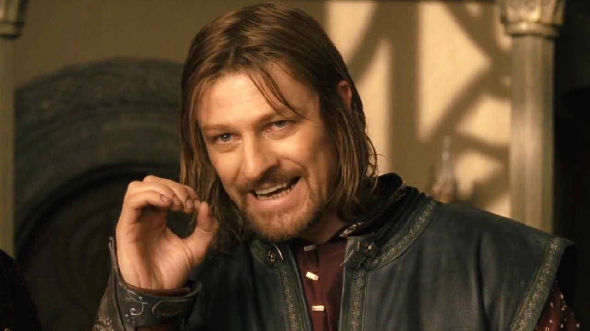
<br><br><br><br>
'*The expected value decreases with each good night to you,*' said Boromir.

## n=3
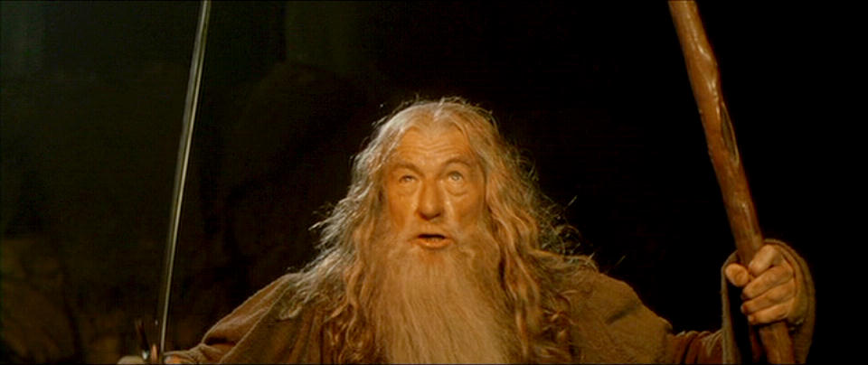
<br><br>
'*Now!*' shouted Gandalf. '*Now is the last one we will let* $E_n (y) = E(y \  | \  S_n = s_n , \dots k - 1\}$.


## n=3
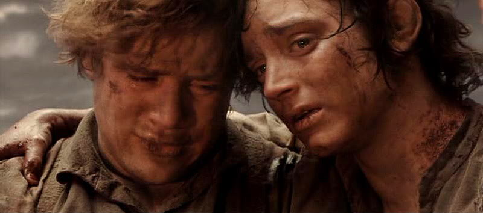
<br>
"*We must decide before we go*", said Frodo. "*It would be the death of me. It would be safer to wait here than that if I go through the algebra needed to demonstrate this for the general case.*"


## n=3
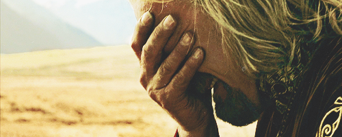
<br><br>
Our days have darkened, and we have shown $||X_i − Y_i|| \leq p_i$.


# A Little Computer Science

## Computer Science
<script language="javascript">
  function animooted(){
    document.getElementById("click2change").src = "pics/cs.gif";
  }
</script>
<center>
  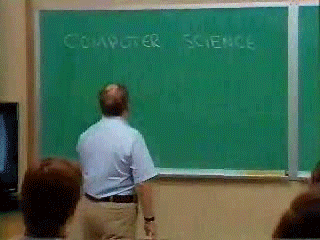
</center>

## Transition Matrices
Full matrix size: $8\cdot N^2$ bytes

* Text size: 1.343 MiB
* n=2 full matrix: 127.688 GiB
* n=3 full matrix: 370.669 GiB
* ngram representation: 5.8 MiB

## How do we do it?
* Linked list
* Hash functions

<center>
  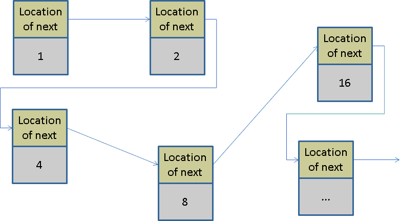
</center>


## Some Benchmarks
```r
library(tau)
library(ngram)

x <- ngram::rcorpus(100000)

tautime <- system.time(pt1 <- textcnt(x, n=3, split=" ", method="string"))[3]
ngtime <- system.time(pt2 <- ngram(x, n=3))[3]

cat("tau: ", tautime, "\nngram: ", ngtime, "\ntau/ngram: ", tautime/ngtime, "\n")
```

```
## tau:  32.671 
## ngram:  0.078 
## tau/ngram:  418.859 
```


## `~`Thanks!`~`
 Email: wrathematics@gmail.com

 GitHub: https://github.com/wrathematics

 Web: http://wrathematics.info

 Blog: http://librestats.com

 Twitter: @wrathematics


<br><br>
<center>
   Slides available: http://fixme.com
</center>
